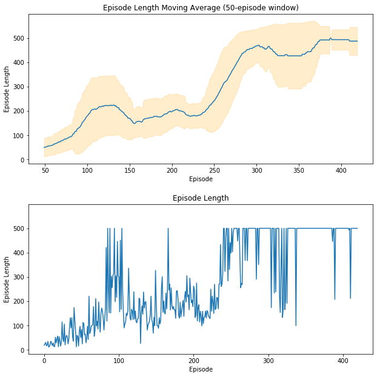
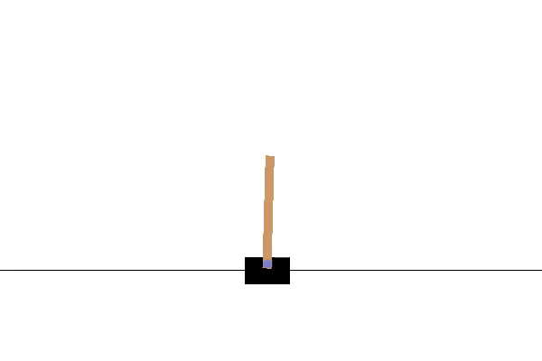

Code for implementing a type of Monte-Carlo Policy gradients algorithm Reinforce to solve the [CartPole-v1](https://gym.openai.com/envs/CartPole-v1/) environment. It is a discrete action control task where we have to apply actions to the cart such that the pole stays in the upright position. 

train_policy_gradient.py - Contains code for learning the optimal policy using policy gradient REINFORCE algorithm. 
The Policy is parametrized by a 2 layer (fully-connected layers with 128 neurons each) neural network defined in utils.py
Learned model is stored as policy_model.pt and can be tested from a function inside the tester code

You can see the training performance:

utils.py - contains code for defining the policy model
Also contains code for testing the model policy_model.pt learned by policy gradient

To see how the policy model actually works, just run test_model.py

